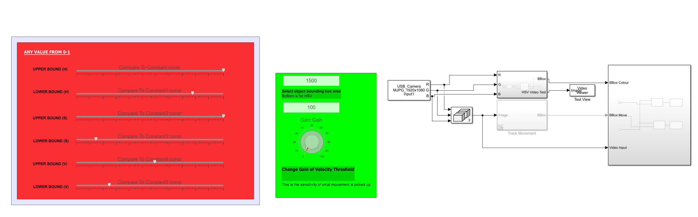
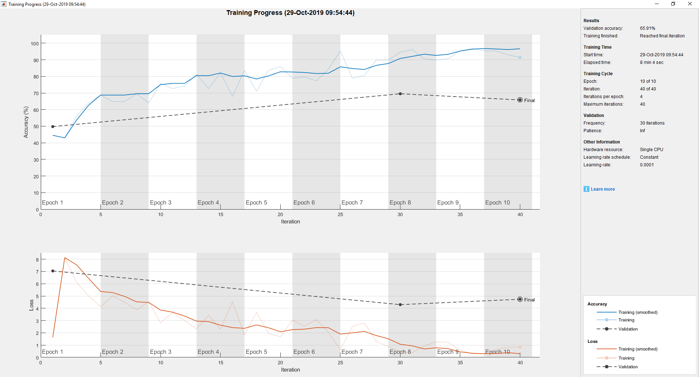

# B-Idea-Testing

This repo is for aggregating tests, programs and results that have been carried out by The Buoys.

Portfolio can be found here at [The Buoys](https://thebeachbuoys.wordpress.com)!

1. [Servo Control Using a Controller](#3-servo-motors-controlled-wirelessly)
    - Last Updated 15/10/2019
2. [Optical Flow Machine Vision](#simulink--optical-flow-model)
    - Last Updated 22/10/2019
3. [Testing the Tracked Rover](#rovertest)
    - Last Updated 21/10/2019
4. [Camera Testing](#camera-tests)
    - Last Updated 25/10/2019
5. [Input Testing](#inputs-tests)
    - Last Updated 25/10/2019
6. [Mbed Testing](#mbed-testing)
    - Last Updated 25/10/2019
7. [Raspberry Pi Testing](#raspberry-pi-testing)
    - Last Updated 03/12/2019
8. [Neural Networks](#deep-learning)
    - Last Updated 29/10/2019
9. [Arduino Publisher](#blink-led-using-ros)
    - Last Updated 24/11/2019
10. [ROS Websocket Control Page](#ros-webpage-control-with-roslibjs)
    - Last Updated 08/01/2020 
11. [ROS Mono Slam](#ros-mono-slam-with-orbslam2)
    - Last Updated 16/01/2020 


# 3 Servo Motors Controlled Wirelessly

This was a test to confirm that the following was in working order:
- Servo Motors from LynxMotion
- Botboarduino from Lynxmotion
- Sparkfun USB Host Shield
- Xbox 360 Reciever and Controller

After testing it was found that all the components named above were in working order, as of 15/10/2019.
However 2 servos as part of one of the servo arms were non-functional.

[Video demonstration](https://youtu.be/stPPC0m9og8)

**Things to note:**
- Botboarduino cannot provide sufficient current to both the reciever and servos at the same time off the 5v rails.
This was solved by changing the supply to the servos to being Vs, which is provided by an external source (Battery).
- Pin 7 needs to be set to high at the start of the program to ensure the version of the host shield works as intended.
- The power supply for 3 servo motors should be 6v and above 1amp (1.5/2amp). This is due to when they are all functional they draw a very large current causing other components in the system to recieve insufficient power.
- The USB Host shield requires around 7v 500mA to function properly, without this the USB port will not function.
- By removing the ``VL=VS`` header on the BotBoarduino the Logic and the Servos can be powered separately, which aids with the reliability of the Host shield. This is due to if the servos draw excessive current the USB device remains powered.

**Connections:**
``BOTBOARD ----> Host Shield``
- D7 ----> D7
- D10 ----> D10
- D11 ----> D11
- D12 ----> D12
- D13 ----> D13

- Currently the system is powered by the NI Virtual Bench Supply. +6v Terminal is connected to VS and +24v is set to 7.5v and connected to VL.

[Current Draw Test](https://github.com/lboroWMEME-19WSD001/B-Idea-Testing/blob/master/Servo%20Control/System%20current%20draw%20test%202019-10-24%2011-42-44.mp4)

- The speaker header has been removed as an intial move to supply more current to the servos.

**Sabertooth 2x12RC | Tracked Rover:**

This is documentation on how to use the Sabertooth 2x12RC

Header switches:
S1,S2,S4,S5,S6 --> DOWN
S3 --> UP
``001000``

- When writing to the motors use ``servo.writeMicroseconds(%num);`` where num is a value from 1000-2000
    - 1000 is both motors forwards, 2000 is both motors backwards and 1500 both stationary


**Sources:**
- https://github.com/felis/USB_Host_Shield_2.0/blob/master/XBOXRECV.h
- https://github.com/felis/USB_Host_Shield_2.0/blob/master/examples/Xbox/XBOXRECV/XBOXRECV.ino
- http://www.lynxmotion.com/images/html/build185.htm
- https://www.dimensionengineering.com/datasheets/Sabertooth2X12RCQuickStart.pdf

# Simulink | Optical Flow model


This is testing learnt knowledge on how to create a model to track movemnt within a video stream. All done in Matlab 2019b.

**Components and Libraries:**

- USB 1080p Camera
- MATLAB Support Package for USB Webcams (19.2.0)
- Symbolic Math Toolbox (8.4)
- Simulink Support Package for Raspberry Pi Hardware (19.2.0)
- Image Processing Toolbox (11.0)
- Computer Vision Toolbox (9.1)



**Rundown:**

- Video stream input as RGB
- Converted to Intensity and fed into an Optical Flow Block
- The output: Intensity image showing the difference between the velocity of areas in the image
(Process could be sped up by changing the frames that are being compared. Currently every frame is compared to one another)
- This data is then filtered based on what velocities we care about (Thresholding)
- Bounding Box: Draws boxes around areas that we want to track. This block also outputs the central coords of each box in relation with the bottom left of the image (in pixels).

**Variables:**
- The minimum area tracked can be changed based on the size of the object being tracked (In pixels)
- The sensitivity can be changed by increasing the gain of the thresholding block

Both of these can be altered while the simulation is runnning.

[Video demonstration](https://www.youtube.com/watch?v=3YoWCa4jGAI)

# Rovertest

Tested the rovor motor to check weather they worked with some simple code on arduino the code simply accelerates both motors untill they reach 180 and then back down to zero. The test was conclusive and showed that both motors worked sucssesfully and can be coded. Other information used was found on the data sheet for the sabortooth 2x 12rc.

The code was simple and worked by checking that both motor were able to move in the forward and reverse direction.
This was done by creating a for loop that stated that when the motor was in position 0 it would move forward until the position was greater than 180, at which point it would leave the for loop and enter another for loop that would move the motor positions from 180 back down to 0.

**To note:**
- Switch 1 on the power board was set down so that each motor could be controlled independently and not in mixed mode.


**Source:**

- https://www.dimensionengineering.com/datasheets/Sabertooth2X12RCQuickStart.pdf

# Camera Tests

Four cameras were provided for the group, 2 HD 1080p cameras and 2 720p webcams. All of the cameras were tested using the same methodology:

1. Plug in power to camera/into a usb device

    +This was passed by all cameras
    
2. Using camera app on windows determine output recieved

    +All cameras displayed a video output when used in conjuction with the camera app
    
3. Visual inspection of the device
    if possible focus and unfocus lens to determine damage to lens

    +Of the cameras only the 1080p cameras had adjustable lenses 
    
    +The camera with the plain labeling was shown to be scratched on the lens
    
    +All of the cameras had scratches on the surface,
    however not impeding the performance in any noticable way
    
    +The 1080p camera with a red label was missing a base stand
    
    +The 720p webcam with a yellow label also had some pen markings on its surface
    
4. Record video using windows 10 camera app make sure to record movement and

5. View the propeties of the video and under the details section record resolution and frames per second rounding to nearest whole number

    +The webcams claiming to be 720p were so
    
    +The 1080p HD cameras were also the resolution given
    
    +The FPS tests revealed a variety of caputring speeds
    
        | Camera              | FPS |
        |--------------------:|:---:|
        | webcam plain        | 29  |
        | webcam yellow label | 27  |
        | 1080 cam plain      | 27  |
        | 1080 cam red label  | 21  |
        
     +These results indicate low resolution cameras to faster capturing speeds, 
     but may have been affected by the software used

# Inputs Tests
The input devices given to the group were, a usb mouse, a usb keyboard, a usb xbox 360 reciever and 2 xbox controllers.

1. All the devices usb devices were plugged into the usb socket of a computer running windows 10 to check if they were capable of recieving power (all devices have a led power indicator)
    + All of the usb devices passed this test successfully
2. The xbox controllers were tested for power by attempting to turn them on using the xbox home button
    + The controller labeled h did not turn on, however when the batteries were replaced it did
3. The mouse was then tested by moving it around and pressing all of the buttons to determine if any of those things were broken
    + They were not
4. The keyboard was then tested, a notepad document was opened and all of the number keys were pressed sequentially and all of the letter keys were then pressed in the order that are layed out on the board
    + All of those keys worked succesfully so it was assumed the keyboard was fully functional
5. The xbox controller and reciever were tested in conjunction, using the new connection button on both a controller and the reciever the devices were paired and the using the game controller diagnostics window located in Devices and Printers/(Controller)/Game Controller Settings/Properties and under the test tab. Then every button and axis was moved
    + The reciever was fully functional
    + The xbox controller labeled k was functional, however when returned to neutral positions the test 
    program registered them as not being in fully neutral position due to the analog sticks getting 
    slightly stuck
    + The xbox controller labeled h was fine
# Mbed Testing
The mbed was tested first by giving it mini usb power to check that it turned on then the mbed compiler's default blinky code was loaded
```C
while(1) {
        myled = 1;
        wait(0.2);
        myled = 0;
        wait(0.2);
    }
```
as this was not the code previously running on the device this meant that it passed the second test of being able to have code uploaded to it. This also verified that the leds on the main board worked
The application board of the mbed was then tested using programs on at https://os.mbed.com/cookbook/mbed-application-board using only programs prefixed with "app-board-". The RGB leds, Speaker, AnalogOut, Joystick and LCD were verified working using this procedure, the USB mouse input test code did not compile.
# Raspberry Pi Testing
The raspberry pi was tested firstly by pluging into a micro usb socket from a phone charger wall adapter and was determined able to recieve power when the leds on the board came on. An image was made of the current software on the raspberry pi's micro sd card and the latest version of raspbian for this board was downloaded onto the board following the instructions at https://www.raspberrypi.org/documentation/installation/installing-images/README.md . After this the raspberry pi was plugged into a monitor using an hdmi to vga adapter and the mouse and keyboard were also plugged in before giving the board power, this validated that the hdmi port and usb socket were functioning.
Then the pi logged in to and setup. Then using a python script the GPIOs
```Python
import RPi.GPIO as GPIO
GPIO.setup(GPIONUM,GPIO.OUT)
GPIO.output(GPIONUM,True)
```
accourding the this diagram https://www.element14.com/community/docs/DOC-73950/l/raspberry-pi-3-model-b-gpio-40-pin-block-pinout , it was assumed if a voltage could come out of a GPIO pin than it would be able to read a voltage as an input.

## Connecting raspberry pi to Matlab


## Setting up multiple machines with ROS and raspberry pi
The .bashrc files of both machines were edited to identify the ROS machine as the master. A talker node was run on the ROS machine while a lister was run on the raspberry pi and it was show that data could be transmitted.

# Deep Learning



# Blink LED using ROS 
The default blink LED code was tested to ensure the Arduino could upload code after the IDe was setup for linix, the code ran fine and upoloading was successful. Next was the supsciber example for ROS:
1. rosrun rosserial_python serial_node.py /dev/ttyACM0 was used to set up the connection 
1. rostopic list was used to get the list of topics
1. rostopic pub toggle_led std_msgs/Empty --once was supposed to blink the Arduino but no change occoured.
1. Subscriber needs to remain set up in its own terminal, trying the command again in new termial toggled the LED.


# ROS Webpage Control with RosLibjs

This section followed a predocumented approach to the use of ROS Java Script libraries to create a usable control webpage to subscribe, publish and get usable data to view the running system. This system would also be able to view video outputs from all systems to better observe and remedy issues that may arise.

[Github Page:EESC-LabRoM](https://github.com/EESC-LabRoM/rosweb)

Following the tutorial on here this websocket server was installed on the Linux Ros machine.

Running the follwing will start the Ros Websocket Server locally:
``$ roslaunch rosbridge_server rosbridge_websocket.launch``

and to run the video server,

``$ rosrun web_video_server web_video_server``

HAS TO BE RUN IN A CHROME WINDOW : http://labrom.eesc.usp.br/rosweb/


# ROS Mono Slam with OrbSlam2

This section details how ORB Slam V2 was implemented using opensource ros packages to simultaneously localise our robot and map an environment to avoid collisions. This is a monocular system since we are intending on implementing this with one usb webcam due to the raspberry pi3 being more reliable when using one camera. To be able to use stereo vision we would have to upgrade to a RPI 4 or use two RPI 3's.

This has been implemented using: (ORB SLAM V2)[https://github.com/appliedAI-Initiative/orb_slam_2_ros]

**Alterations have been made to the following files in the following folders! These will need changing if either the camera changes or if the environement changes (Current Environment: PROJECT ROOM)**

- ``/home/catkin_ws/src/orb_slam_2_ros/orb_slam2/config/head_camera.yaml``

This file determines the camera parameters after being normalised to remove abberation from the fish eye effect.
This can be done through ``$ rosrun camera_calibration cameracalibrator.py --size 6x4 --square 0.114 image:=/usb_cam/image_raw camera:=/usb_cam``. Changing the parameters where necessary.

- ``/home/catkin_ws/src/orb_slam_2_ros/ros/launch/orb_slam2_headcamera_mono.launch``

This file contains the necessary information for running the launching of ORBSLAM2. This can be changed to accomodate for 
a different camera publisher by changing the 'to.' inside the remap to that of the camera publisher being used.
In this case it is usb_cam/image_raw

**RUNNING THE PROGRAM (STEP-BY-STEP)**

*ensure that in every terminal catkin_ws is sourced!*

1. ``$ roscore``
2. ``$ roslaunch usb_cam usb_cam-test.launch``
3. ``$ roslaunch orb_slam2_ros orb_slam2_headcamera_mono.launch ``
4. ``$ rviz``

Use ``$ rqt_graph`` to double check if all the nodes and topics are correct!

*Example:*


**Using RVIZ to visualise a crude URDF Model of the Tri-Track**


